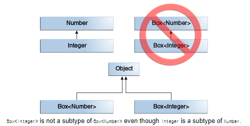
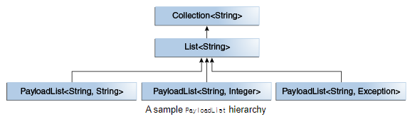
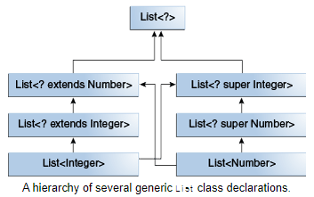

# Generics

- 배경
- 제네릭을 왜 쓰는가
- 제네릭
- 제네릭 메서드

## 배경

- 컴파일 버그는 일찍이 탐지되기 때문에 디버그가 쉽다.
- 런타임 버그는 나중에 발견되기 때문에 디버그가 어렵다.
- 제네릭은 컴파일 타임에 타입을 체크하기 때문에 런타임 버그를 줄여준다.

## 제네릭을 왜 쓰는가

### formal parameter vs type parameter

- 간단히 말해서, 제네릭은 클래스<sup>인터페이스, 메서드</sup>를 정의할 때 타입 파라미터를 사용할 수 있게 해준다.
- 타입 파라미터는 같은 코드에 다른 타입의 input을 받을 수 있게 해준다.
- 다른 점은 formal paramter는 value를 받고, 타입 파라미터는 type을 받는다는 것이다.

### generic code vs non-generic code

- 컴파일 타임의 타입 체크
- 캐스팅 제거
- 개발자가 제네릭 알고리즘을 구현할 수 있음
    - 다른 타입의 컬렉션, 커스터마이즈 가능, 타입 안정성, 코드 가독성

### non-generic code 의 불안정성

```java
public class Foo {
    public static void main(String[] args) {
        Box box1 = new Box();
        box1.set("hello");
        Integer val = (Integer) box1.get(); // java.lang.ClassCastException
    }
}

public class Box {
    private Object object;

    public void set(Object object) {
        this.object = object;
    }

    public Object get() {
        return object;
    }
}
```

## 제네릭

```java
public class Foo {
    public static void main(String[] args) {
        Box<Integer> box1 = new Box<Integer>();
        box1.set("hello"); // Compile Error  Required type: Integer
    }
}

public class Box<T> {
    private T t;

    public void set(T t) {
        this.t = t;
    }

    public T get() {
        return t;
    }
}

```

### 제네릭 포맷

````
class name<T1, T2, ..., Tn> { /* ... */ }
````

### Type Parameter Naming Conventions

- single character
- uppercase letter

#### Ex.

- E - Element (used extensively by the Java Collections Framework)
- K - Key
- N - Number
- T - Type
- V - Value
- S,U,V etc. - 2nd, 3rd, 4th types

### Multiple Type Parameters

```java
public interface Pair<K, V> {
    public K getKey();

    public V getValue();
}

public class OrderedPair<K, V> implements Pair<K, V> {

    private K key;
    private V value;

    public OrderedPair(K key, V value) {
        this.key = key;
        this.value = value;
    }

    public K getKey() {
        return key;
    }

    public V getValue() {
        return value;
    }
}
```

## RawTypes 은 지양하라

### RayTypes?

- 제네릭 클래스를 인스턴스화 할 때 타입 매개변수 <sup>type argument</sup>를 생략하는 것

````
Box rawBox = new Box<>();
````

### RawTypes 은 제네릭의 타입 체크를 bypass 한다

```java
public class Foo {
    public static void main(String[] args) {
        Box rawBox = new Box();           // rawBox is a raw type of Box<T>
        Box<Integer> intBox = rawBox;     // warning: Unchecked assignment: '...Box' to '...Box<java.lang.Integer>'

        Box<String> stringBox = new Box<>();
        Box rawBox = stringBox;
        rawBox.set(8);  // warning: Unchecked call to 'set(T)' as a member of raw type '...Foo'
    }
}

```

### Unchecked Error Messages 자세히 보기

```java
public class WarningDemo {
    public static void main(String[] args) {
        Box<Integer> bi;
        bi = createBox(); // Unchecked assignment: 'generics.WarningDemo.Box' to 'generics.WarningDemo.Box<java.lang.Integer>'
        //  uses unchecked or unsafe operations.
        // java: Recompile with -Xlint:unchecked for details.
    }

    static Box createBox() {
        return new Box();
    }

    public static class Box<T> {
        private T t;

        public void set(T t) {
            this.t = t;
        }

        public T get() {
            return t;
        }
    }
}
```

위 코드를 컴파일하면 주석과 같은 메시지를 출력한다.  
이 떄 -Xlint:unchecked 컴파일 옵션을 추가하면 디테일하게 아래 메시지를 확인할 수 있다.

```bash
java: unchecked conversion
  required: generics.WarningDemo.Box<java.lang.Integer>
  found:    generics.WarningDemo.Box
```

@SuppressWarnings 을 사용하여 모든 unchecked 경고를 컴파일 타임에서 무시할 수 있다.

````
@SuppressWarnings("unchecked")
````

## 제네릭 메서드

- static, non-static 메서드 둘 다 가능
- 제네릭 타입의 scope 은 메서드 한정
- 타입추론 <sup>type inference</sup> 가능
    - 제네릭 메서드를 일반 메서드처럼 사용 가능
    - java compiler 가 타입을 알아서 추론해냄

```java
public class Util {
    public static <K, V> boolean compare(Pair<K, V> p1, Pair<K, V> p2) {
        return p1.getKey().equals(p2.getKey()) &&
                p1.getValue().equals(p2.getValue());
    }
}

public class Pair<K, V> {
    private K key;
    private V value;

    public Pair(K key, V value) {
        this.key = key;
        this.value = value;
    }
    // ...
}

public class Foo {
    public static void main(String[] args) {
        Pair<Integer, String> p1 = new Pair<>(1, "world");
        Pair<Integer, String> p2 = new Pair<>(2, "world");
        System.out.println(Util.compare(p1, p2));
    }
}
```

## Bounded Type Parameters

- 제네릭 타입의 범위를 제한하고 싶을 때

```java
public<U extends Number> void printTypeParameter(U u){
        System.out.println(u.getClass().getName());
        }

// ...

        printTypeParameter(1);
        printTypeParameter("이건 안되지"); // compile error : reason: no instance(s) of type variable(s) exist so that String conforms to Number
```

### 제네릭 메서드와 Bounded Type Parameters

```java

public static<T> int countGreaterThan(T[]anArray,T elem){
        int count=0;
        for(T e:anArray)
        if(e>elem)  // compiler error : Operator '>' cannot be applied to 'T', 'T'
        ++count;
        return count;
        }

```

- Object 타입에는 대소 비교를 할 수 없음

#### Comparable 인터페이스를 구현한 타입만 사용하도록 제한

```java
public static<T extends Comparable<T>> int countGreaterThan(T[]anArray,T elem){
        int count=0;
        for(T e:anArray)
        // if (e > elem)  // compiler error : Operator '>' cannot be applied to 'T', 'T'
        if(e.compareTo(elem)>0)
        ++count;
        return count;
        }
```

## 제네릭, 상속, 서브타입

### is a 관계

```java
public class Foo {

    public static void main(String[] args) {
        /**
         * Nubmer와 Integer의 is a 관계
         * Integer is a Number
         * Double is a Number
         * */
        Object obj1 = new Object();
        Integer int1 = new Integer(1);
        obj1 = int1;

        someMethod1(new Integer(1));
        someMethod1(new Double(1.0));

        someMethod2(new Integer(2));
        someMethod2(new Double(2.0));
    }

    public static void someMethod1(Number n) {
        System.out.println(n);
    }

    public static <T extends Number> void someMethod2(T t) {
        System.out.println(t);
    }
}
```

### Box\<Integer> is not a Box\<Number>

  

```java
public class Foo {

    public static void main(String[] args) {
        someMethod3(new Box<Integer>(1)); // compile error
    }

    public static void someMethod3(Box<Number> n) {
        System.out.println(n);
    }
}
```

### 제네릭 클래스와 서브타이핑



## Type Inference <sup>타입추론</sup>

- java 컴파일러의 능력
- 메서드 호출과 시그니처를 살펴 적용 가능한 타입 인자를 결정

```java
public class Foo {
    public static void main(String[] args) {
        ArrayList<BoxTmp<Integer>> listOfIntegerBoxes = new ArrayList<>();
        /**
         *
         * 첫번째 매개변수가 Integer 타입이라는 걸 생략해도 컴파일러가 Integer 타입으로 추론해냄
         * */
        addBox(Integer.valueOf(10), listOfIntegerBoxes);
        addBox(Integer.valueOf(20), listOfIntegerBoxes);
        addBox(Integer.valueOf(30), listOfIntegerBoxes);
        outputBoxes(listOfIntegerBoxes);
    }

    public static <U> void addBox(U u, List<BoxTmp<U>> boxes) {
        BoxTmp<U> box = new BoxTmp<>();
        box.set(u);
        boxes.add(box);
    }

    public static <U> void outputBoxes(List<BoxTmp<U>> boxes) {
        int counter = 0;
        for (BoxTmp<U> box : boxes) {
            U boxContents = box.get();
            System.out.println("Box #" + counter + " contains [" + boxContents.toString() + "]");
            counter++;
        }
    }
}

```

### 타입 추론과 제네릭 클래스의 객체화

```java
public class Foo {
    public static void main(String[] args) {
        java.util.Map<String, List<String>> myMap1 = new HashMap<String, List<String>>(); // Explicit type argument String, List<String> can be replaced with <>
        java.util.Map<String, List<String>> myMap2 = new HashMap<>();
        java.util.Map<String, List<String>> myMap3 = new HashMap(); // / unchecked conversion warning
    }
}
```

### 타입 추론과 제너릭 생성자

```java
public class Foo {
    public static void main(String[] args) {
        new MyClass<Integer>("");
        MyClass<Integer> myObject = new MyClass<>(""); // X에 Integer 유추, T에 String 유추
    }
}

public class MyClass<X> {
    <T> MyClass(T t) {
        System.out.println(t);
    }
}
```

### Target Types

```java
//  java.util.Collections.emptyList()
@SuppressWarnings("unchecked")
public static final<T> List<T> emptyList(){
        return(List<T>)EMPTY_LIST;
        }

public class Foo {
    public static void main(String[] args) {
        List<String> list1 = Collections.emptyList();
        List<String> list2 = Collections.<String>emptyList();

        doWithStringList(Collections.emptyList());
    }

    private static void doWithStringList(List<String> strList) {
        //do something with string list
    }
}

```

## Wildcards

- 와일드 카드 : unknown type
- 타입 파라미터, 지연 변수, 리턴 타입에서 사용
- 미사용 : 타입 인수, 일반 메서드 포출, 일반 클래스 인스턴스 생성

### Upper Bounded Wildcards

- 변수에 제한을 낮추기 위함
- List<Integer>, List<Double>, List<Number> 모두에서 사용 가능한 메서드 작성 시

```java
// Number 타입과 매치
List<Number>

// Number와 그 서브타입까지 모두 매치
List<?extends Number>
```

```java
public class Foo {
    public static void main(String[] args) {
        doSomething(new ArrayList<Integer>());
        doSomething(new ArrayList<Double>());
    }

    public static void doSomething(List<? extends Number> numbers) {
        System.out.println(numbers);
    }
}
```

### Unbounded Wildcards <sup>제한 없는 와일드 카드</sup>

```java
List<?> list
```

- 모든 타입에 대해 매치

```java
public class Foo4 {

    public static void main(String[] args) {
        List<Integer> list1 = Arrays.asList(1, 2, 3, 4);
        loopList1(list1); // java: incompatible types: java.util.List<java.lang.Integer> cannot be converted to java.util.List<java.lang.Object>
        loopList2(list1); // enable

        List<String> list2 = Arrays.asList("one", "two", "three");
        loopList2(list2);
    }

    public static void loopList1(List<Object> list) {
        for (Object obj : list) {
            System.out.println(obj + " value 1");
        }
    }

    public static void loopList2(List<?> list) {
        for (Object obj : list) {
            System.out.println(obj + " value 2");
        }
    }
}
```

### Lower Bounded Wildcards <sup>하한 제한 와일드 카드</sup>

```java
List<? super Integer>list
```

- 타입의 하한을 제한
- 위 코드는 Integer 슈퍼 타입만 가능 <sub>Integer 포함</sub>

```java

public class Foo {

    public static void main(String[] args) {
        List<? super Integer> objList = makeNumberList(new ArrayList<Object>());
        List<? super Integer> numberList = makeNumberList(new ArrayList<Number>());
        List<? super Integer> intList = makeNumberList(new ArrayList<Integer>());

        List<? super Integer> doubList = makeNumberList(new ArrayList<Double>()); // java: incompatible types: java.util.ArrayList<java.lang.Double> cannot be converted to java.util.List<? super java.lang.Integer>
    }

    public static List<? super Integer> makeNumberList(List<? super Integer> numbers) {
        for (int i = 1; i <= 10; i++) {
            numbers.add(i);
        }
        return numbers;
    }
}

```

### Wildcards and Subtyping

  

```java

public class Foo6 {

    public static void main(String[] args) {

        List<Parent> parentList = new ArrayList<>();
        List<Child> childList = new ArrayList<>();

        // parentList = childList; // java: incompatible types: java.util.List<generics.Foo.Child> cannot be converted to java.util.List<generics.Foo.Parent>

        List<? extends Parent> parents = new ArrayList<>();
        List<? extends Child> childs = new ArrayList<>();

        parents = childs; // enable
    }

    private static class Parent {
    }

    private static class Child extends Parent {
    }
}

```

- Child 는 Parent의 서브 타입
- **그러나 List<Child> 는 List<Parent> 의 서브 타입이 아님**
- List<Child> 는 List<? extends Parent> 의 서브 타입
- 와일드카드를 사용해서 서브타입으로 만들 수 있음

### Wildcard Capture and Helper Methods

- Wildcard Capture : 컴파일러가 와일드카드의 타입을 추론해내는 것
- "capture of" 컴파일 에러는 주의할것

```java
public class Foo {
    void ex1(List<?> list) {
        list.set(0, list.get(0)); // java: incompatible types: java.lang.Object cannot be converted to capture#1 of ?
    }
}
```

- 컴파일러는 개발자가 잘못된 타입을 할당했다고 추론함
    - **제네릭 존재 이유 : 컴파일 타임의 타입 체크**

#### private helper method <sup>originalMethodNameHelper</sup>

```java
public class Foo7 {
    void ex1(List<?> list) {
        ex2(list);
    }

    private <T> void ex2(List<T> list) {
        list.set(0, list.get(0));
    }
}

```

- 컴파일러가 ex2의 T를 통해 타입 추론

#### bad wildcard error example

list1. list2의 타입이 서로 다를 수도 있기 때문에 좋지 않음

```java
void swapFirstIdx(List<?extends Number> list1,List<?extends Number> list2){
        Number tmp=list1.get(0);
        list1.set(0,list2.get(0)); // java: incompatible types: java.lang.Number cannot be converted to capture#1 of ? extends java.lang.Number
        list2.set(0,tmp); // java: incompatible types: java.lang.Number cannot be converted to capture#2 of ? extends java.lang.Number
        }
```

### Wildcard 가이드 라인

#### 가이드 1 : 변수의 2가지 기능

```java
/**
 * a : in 변수
 * b : out 변수
 */
public int copyAToB(int a,int b){
        b=a;
        return b;
        }
```

- In 변수 : "in" 파라미터, 메서드 안에서 쓰이는 변수
- Out 변수 : "out" 파라미터, 메서드 밖 어디선가 쓰일 변수
- In, Out 둘 다 쓰이는 변수도 있음

> ##### Wildcard Guidelines
>
> - upper bounded wildcard <sub> ? extends T </sub> : "in" 변수
> - lower bounded wildcard <sub> ? super T </sub> : "out" 변수
> - unbounded wildcard <sub> ? </sub> : "in" 변수가 Object 클래스의 메서드에 의해 사용될 때
> - 와일드 카드 사용 안됨 : "in" 과 "out" 변수가 모두 사용하는 코드
> - 리턴 타입을 와일드카드로 사용하지 말 것 : API 사용자가 와일드카드를 사용하게 강제함

## Type Erasure <sup>타입 소거</sup>

타입 소거 : 제네릭을 구현하기 위해 Java 컴파일러가 사용하는 메커니즘

- 제네릭 타입의 타입 매개변수를 해당 경계로 대체
    - 타입 매개변수가 경계가 없다면 Object로 대체
- 바이트 코드에는 보통의 클래스, 인터페이스, 메서드만 있음
- 타입 안정성을 위해 필요한 경우 형변환
- 확장된 제네릭 타입의 다형성을 유지하기 위해 브릿지 메서드 생성

### Erasure of Generic Types <sup>제네릭 타입의 타입 소거</sup>


## 참고

- https://docs.oracle.com/javase/tutorial/java/generics/index.html
- https://docs.oracle.com/javase/tutorial/extra/generics/index.html
